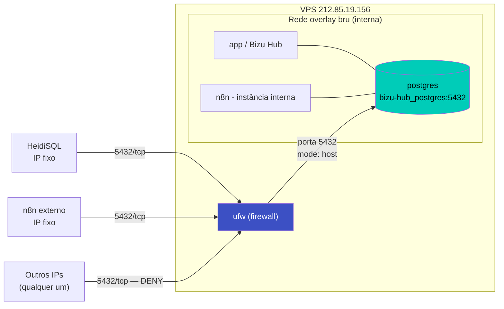

# Acesso Externo ao PostgreSQL — Bizu Hub (VPS Docker Swarm)

> Documento de infraestrutura. Complementa `CLAUDE.md`, `.context/onboarding/AI_CONTEXT.md` e `.context/spec/TECHNICAL_SPEC_COMPACT.md`.
> Escopo: como o banco PostgreSQL da stack `bizu-hub` passou a aceitar conexões externas (HeidiSQL, n8n e outras ferramentas), de forma segura, via firewall — sem depender de túnel SSH.

---

## Objetivo

Permitir que ferramentas externas ao VPS (ex: HeidiSQL na máquina local, instâncias de n8n fora do Swarm) leiam e gravem no PostgreSQL da stack `bizu-hub`, mantendo:

- O banco **inacessível** para qualquer IP não autorizado.
- Ferramentas que já rodam **dentro do mesmo Swarm/rede `bru`** continuando a acessar o banco internamente, sem exposição nenhuma.
- Nenhuma dependência de túnel SSH (incompatível com ferramentas automatizadas como n8n, que precisam de conexão persistente sem supervisão humana).

---

## Diagnóstico inicial

Na stack original (`deploy/docker-stack.yml` equivalente no Portainer), o serviço `postgres` **não publicava nenhuma porta** — só era alcançável dentro da rede overlay `bru`, via DNS interno do Swarm (`bizu-hub_postgres:5432`, no padrão `<nome_da_stack>_<nome_do_serviço>`). Esse é o comportamento seguro por padrão, mas impedia conexão de fora da VPS.

### Por que não usar túnel SSH como solução definitiva

Túnel SSH (`ssh -L 5432:127.0.0.1:5432 ...`) funciona bem para acesso humano pontual (ex: abrir o HeidiSQL manualmente), mas é uma má escolha para ferramentas que precisam de conexão contínua e desassistida, como o n8n:

- Exige um processo supervisionando o túnel 24/7 (se cair, a automação para).
- Exige guardar chave/senha SSH em outro lugar para autenticação automatizada.
- É um ponto único de falha adicional sem necessidade.

### Decisão final

Expor a porta `5432` no host e controlar o acesso por **firewall (ufw) com allowlist de IP**, em vez de depender de binding em `127.0.0.1` ou túnel.

**Detalhe técnico importante:** em modo Docker Swarm, portas publicadas (`ports:` em um serviço com `deploy:`) são **sempre expostas em `0.0.0.0`** (todas as interfaces), independentemente de configurar `host_ip: 127.0.0.1`. Isso é um comportamento documentado do Swarm — diferente do Docker standalone/Compose sem Swarm, onde restringir a porta a `127.0.0.1` funciona normalmente. Por isso, em serviços Swarm, **o firewall do host é a única camada confiável de restrição de acesso**, não o binding da porta.

### Arquitetura resultante



| Tipo de ferramenta | Caminho de acesso | Exposição externa |
|---|---|---|
| Interna ao Swarm (ex: n8n na mesma VPS) | Rede overlay `bru` → DNS interno `bizu-hub_postgres:5432` | Nenhuma — tráfego nunca sai do Docker |
| Externa com IP fixo (ex: HeidiSQL, n8n externo) | Porta `5432` publicada no host → filtrada pelo `ufw` | Sim, mas restrita por IP de origem |
| Qualquer outro IP | — | Bloqueada (`DENY`) |

---

## 1. Alteração na stack (Portainer → Editor)

Adicionado o bloco `ports` ao serviço `postgres`, mantendo todo o restante igual:

```yaml
  postgres:
    image: postgres:16-alpine
    volumes:
      - bizu_hub_postgres_data:/var/lib/postgresql/data
    networks:
      - bru
    ports:
      - target: 5432
        published: 5432
        protocol: tcp
        mode: host
    environment:
      POSTGRES_USER: ${POSTGRES_USER}
      POSTGRES_PASSWORD: ${POSTGRES_PASSWORD}
      POSTGRES_DB: ${POSTGRES_DB}
    healthcheck:
      test: ["CMD-SHELL", "pg_isready -U ${POSTGRES_USER} -d ${POSTGRES_DB}"]
      interval: 10s
      timeout: 5s
      retries: 5
      start_period: 15s
    deploy:
      mode: replicated
      replicas: 1
      restart_policy:
        condition: on-failure
      placement:
        constraints:
          - node.role == manager
```

**Por que `mode: host` em vez do padrão (`ingress`):** com apenas 1 réplica em um único nó manager, `mode: host` publica a porta diretamente no nó onde a task roda, evitando a camada extra de load balancing (routing mesh/IPVS) do modo `ingress` — que não traz benefício nenhum para um serviço de banco com réplica única.

Aplicado via **Update the stack** no Portainer (recria apenas o container do `postgres`; volume `bizu_hub_postgres_data` preservado; o `app` reconecta automaticamente graças ao `restart_policy: on-failure`).

---

## 2. Configuração do firewall (ufw)

> ⚠️ A ordem dos comandos importa — liberar o SSH **antes** de aplicar `default deny incoming` evita travar o acesso remoto à VPS.

```bash
# 1. Garantir que o SSH continua liberado
sudo ufw allow OpenSSH

# 2. Liberar tráfego web (Traefik já recebe nessas portas)
sudo ufw allow 80/tcp
sudo ufw allow 443/tcp

# 3. Liberar o Postgres SOMENTE para IPs fixos autorizados
sudo ufw allow from 45.188.74.138 to any port 5432 proto tcp

# 4. Bloquear 5432 para qualquer outro IP
sudo ufw deny 5432/tcp

# 5. Política padrão e ativação
sudo ufw default deny incoming
sudo ufw default allow outgoing
sudo ufw enable
```

> Boa prática seguida na ativação: antes de fechar a sessão SSH original, foi aberta uma segunda sessão para confirmar que o acesso remoto continuava funcionando após o `ufw enable`.

### Estado final das regras (`sudo ufw status numbered`)

```
Status: active

     To                         Action      From
     --                         ------      ----
[ 1] OpenSSH                    ALLOW IN    Anywhere
[ 2] 80/tcp                     ALLOW IN    Anywhere
[ 3] 443/tcp                    ALLOW IN    Anywhere
[ 4] 5432/tcp                   ALLOW IN    45.188.74.138
[ 5] 5432/tcp                   DENY IN     Anywhere
[ 6] OpenSSH (v6)                ALLOW IN    Anywhere (v6)
[ 7] 80/tcp (v6)                 ALLOW IN    Anywhere (v6)
[ 8] 443/tcp (v6)                ALLOW IN    Anywhere (v6)
[ 9] 5432/tcp (v6)               DENY IN     Anywhere (v6)
```

O `ALLOW` específico do IP (regra 4) precisa aparecer **antes** do `DENY` geral (regra 5) — o `ufw` aplica as regras na ordem listada, primeira que casar vence.

---

## 3. Validação

```bash
# Confirma que a porta está escutando no host
ss -tlnp | grep 5432
# esperado: algo como 0.0.0.0:5432

# Testa conectividade a partir de um IP liberado
nc -vz 212.85.19.156 5432
# esperado: succeeded
```

Conexão validada com sucesso via HeidiSQL a partir do IP `45.188.74.138`.

---

## 4. Como conectar

### Ferramentas externas (IP fixo, liberado no ufw)

```
Host:  212.85.19.156
Porta: 5432
Usuário: valor de POSTGRES_USER (.env)
Senha:   valor de POSTGRES_PASSWORD (.env)
Banco:   valor de POSTGRES_DB (.env)
```

> Credenciais reais ficam em `deploy/.env.portainer.example` / variáveis da stack — **não duplicar valores reais neste documento**.

### Ferramentas internas (mesmo Swarm/rede `bru`)

Basta o serviço estar na rede `bru` e usar o hostname interno (não precisa de IP, porta publicada nem regra de firewall):

```yaml
services:
  n8n:
    image: n8nio/n8n
    networks:
      - bru
    environment:
      DB_TYPE: postgresdb
      DB_POSTGRESDB_HOST: bizu-hub_postgres   # <nome_da_stack>_<serviço>
      DB_POSTGRESDB_PORT: 5432
      DB_POSTGRESDB_DATABASE: ${POSTGRES_DB}
      DB_POSTGRESDB_USER: ${POSTGRES_USER}
      DB_POSTGRESDB_PASSWORD: ${POSTGRES_PASSWORD}

networks:
  bru:
    external: true
    name: bru
```

> **Pré-requisito:** o nome da stack no Portainer precisa ser exatamente `bizu-hub` para o DNS interno `bizu-hub_postgres` resolver. Vale confirmar isso no Portainer caso o hostname não resolva.

---

## 5. Runbook — liberar um novo IP externo no futuro

```bash
# liberar
sudo ufw allow from NOVO_IP to any port 5432 proto tcp

# revogar (quando o IP não precisar mais de acesso)
sudo ufw status numbered          # localizar o número da regra
sudo ufw delete <numero_da_regra>
```

Sempre confirmar com `sudo ufw status numbered` que a regra de `ALLOW` do IP ficou **antes** da regra `DENY 5432/tcp` geral.

---

## Boas práticas / Segurança

- **Senha do Postgres:** como a porta fica exposta (mesmo que filtrada por IP), vale revisar periodicamente se `POSTGRES_PASSWORD` é robusta.
- **IPs dinâmicos:** essa abordagem depende de IP fixo. Se alguma ferramenta externa mudar de IP (ex: troca de provedor, IP residencial dinâmico), a regra do `ufw` precisa ser atualizada — esse é o principal custo de manutenção do modelo.
- **Hardening opcional (não aplicado ainda):**
  - Forçar `sslmode=require` na conexão (exige configurar certificado TLS no Postgres, que não vem habilitado por padrão na imagem oficial).
  - Trocar a porta publicada (ex: `15432` em vez de `5432`) para reduzir ruído de scanners automáticos — apenas redução de ruído, a defesa real continua sendo o `ufw`.
- **Princípio geral:** sempre preferir acesso interno via rede `bru` quando a ferramenta puder rodar no mesmo Swarm. Exposição externa é o último recurso, usada aqui apenas para ferramentas que de fato rodam fora da VPS.

---

## Troubleshooting / Rollback

| Sintoma | Causa provável | Ação |
|---|---|---|
| HeidiSQL não conecta | IP de origem não está na allowlist do `ufw` | `sudo ufw status numbered` e adicionar o IP correto |
| `nc -vz` trava ("filtered") | Porta não publicada no Swarm ainda, ou stack não foi atualizada | Confirmar `ports:` no serviço e refazer "Update the stack" no Portainer |
| Perdeu acesso SSH depois do `ufw enable` | Regra `OpenSSH`/porta SSH não liberada antes do `default deny incoming` | Acessar via console do provedor da VPS (fora do SSH) e rodar `ufw disable`, revisar regras, `ufw enable` de novo |
| Quer remover acesso externo por completo | — | Remover bloco `ports` do serviço `postgres` na stack + `sudo ufw delete` nas regras de `5432/tcp` |

---

## Pendência operacional registrada

No momento da configuração, a VPS sinalizou `*** System restart required ***` (atualização de kernel/libs via `unattended-upgrades`), independente desta mudança de firewall/Swarm. Recomendado agendar um reboot da VPS em horário de baixo tráfego — os serviços do Swarm voltam automaticamente (`restart_policy: on-failure` + reagendamento de tasks), mas o restart não deve ficar pendente por muito tempo.

---

## Referências

- Docker Docs — Port publishing and mapping (comportamento de binding em Swarm vs standalone): https://docs.docker.com/engine/network/port-publishing/
- `ufw` — manual padrão do Ubuntu (`man ufw`)

