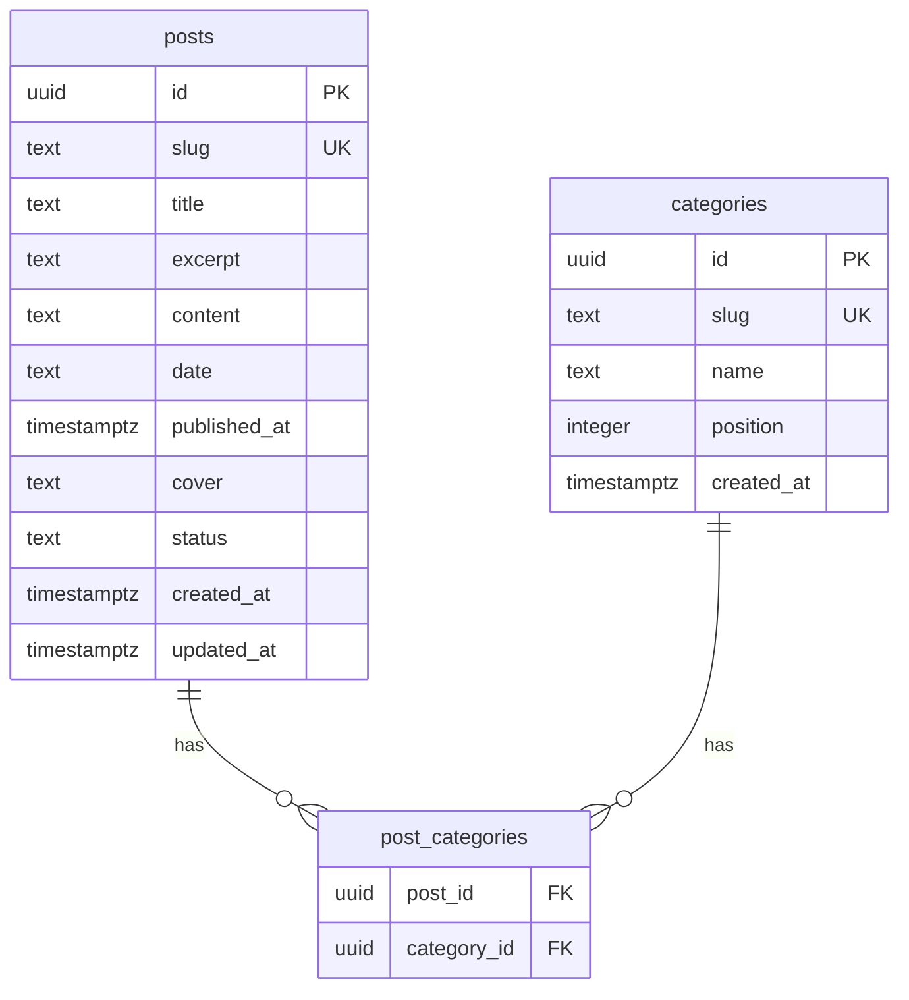

# Data Model: Sistema de Categorização de Posts

**Feature ID**: `002`  
**Date**: 2026-06-26

---

## Diagrama ER



> **Removido**: coluna `posts.tag` (substituída por M2M).

---

## Tabela `categories`

| Coluna       | Tipo                     | Constraints        | Notas                          |
|--------------|--------------------------|--------------------|--------------------------------|
| `id`         | `uuid`                   | PK, default random |                                |
| `slug`       | `text`                   | NOT NULL, UNIQUE   | Kebab-case ASCII (research R1) |
| `name`       | `text`                   | NOT NULL           | Rótulo pt-BR na UI             |
| `position`   | `integer`                | NOT NULL, default 0| Ordem no menu                  |
| `created_at` | `timestamptz`            | NOT NULL, default now |                             |

**Seed inicial (migration)**:

| slug           | name          | position |
|----------------|---------------|----------|
| produtividade  | Produtividade | 1        |
| negocios       | Negócios      | 2        |
| ferramentas    | Ferramentas   | 3        |
| teste          | Teste         | 99       |

---

## Tabela `post_categories`

| Coluna        | Tipo   | Constraints                                      |
|---------------|--------|--------------------------------------------------|
| `post_id`     | `uuid` | FK → `posts.id`, ON DELETE CASCADE, NOT NULL     |
| `category_id` | `uuid` | FK → `categories.id`, ON DELETE CASCADE, NOT NULL |

**Constraints adicionais**:
- PRIMARY KEY ou UNIQUE `(post_id, category_id)` — impede duplicata de vínculo.

**Cardinalidade**: 0..N categorias por post; 0..N posts por categoria.

---

## Drizzle schema (referência implementação)

```typescript
export const categories = pgTable("categories", {
  id: uuid("id").primaryKey().defaultRandom(),
  slug: text("slug").notNull().unique(),
  name: text("name").notNull(),
  position: integer("position").notNull().default(0),
  createdAt: timestamp("created_at", { withTimezone: true, mode: "string" })
    .notNull()
    .defaultNow(),
});

export const postCategories = pgTable(
  "post_categories",
  {
    postId: uuid("post_id")
      .notNull()
      .references(() => posts.id, { onDelete: "cascade" }),
    categoryId: uuid("category_id")
      .notNull()
      .references(() => categories.id, { onDelete: "cascade" }),
  },
  (t) => [primaryKey({ columns: [t.postId, t.categoryId] })],
);
```

Remover de `posts`: campo `tag`.

---

## Tipos TypeScript (server → UI)

```typescript
export type PostCategorySummary = {
  slug: string;
  name: string;
  position?: number; // opcional na UI; útil para ordenar badges
};

export type PostWithRelations = Post & {
  categories: PostCategorySummary[];
  images: PostImage[];
  media: PostMedia[];
  attachments: PostAttachment[];
  readTime: string;
};

export type BlogMenuCategory = PostCategorySummary; // slug + name + position
```

---

## Regras de negócio

| Regra | Descrição |
|-------|-----------|
| RB-001 | Post com `categories.length === 0` → UI exibe **"Sem categoria"** |
| RB-002 | Menu `/blog` lista categorias com ≥1 post `published` (query DISTINCT) |
| RB-003 | Item **"Sem categoria"** no menu não corresponde a row em `categories` |
| RB-004 | Filtro por slug DB: post visível se `categories.some(c => c.slug === active)` |
| RB-005 | Migration: `posts.tag` mapeado para `categories.name` (match exato) |
| RB-006 | Sem CRUD — inserts/updates apenas via migration, seeds ou sistema externo |

---

## Migration de dados (`tag` legado)

```sql
INSERT INTO post_categories (post_id, category_id)
SELECT p.id, c.id
FROM posts p
INNER JOIN categories c ON c.name = p.tag;
```

Após validação: `ALTER TABLE posts DROP COLUMN tag;`

Posts cujo `tag` não match nenhuma categoria seed → **não deve ocorrer** com dados atuais; se ocorrer, migration falha (FK insert vazio) — validar pre-flight com `SELECT DISTINCT tag FROM posts`.

---

## Índices recomendados

| Índice | Coluna(s) | Motivo |
|--------|-----------|--------|
| `post_categories_post_id_idx` | `post_id` | Join em `getAllPosts` |
| `post_categories_category_id_idx` | `category_id` | Join menu categorias |

---

## Impacto em seeds

| Script | Mudança |
|--------|---------|
| `seed-posts.ts` | Remover `tag`; após insert post, `INSERT post_categories` lookup por slug |
| `seed-test-post.ts` | Associar slug `teste` |
| `seed-full.ts` | Sem mudança estrutural (delega aos outros) |

Helper sugerido: `linkPostToCategories(db, postSlug, categorySlugs: string[])`.

---
