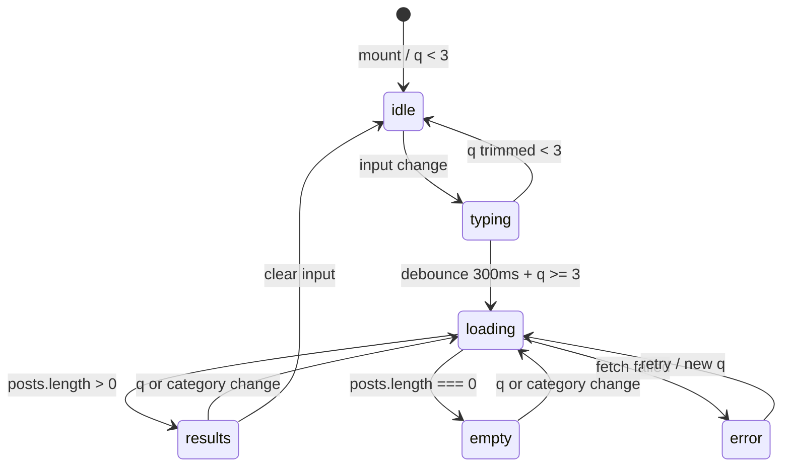

# Data Model: Busca no Blog

**Feature ID**: `003`  
**Date**: 2026-06-27

---

## Entidades lógicas (sem novas tabelas)

Esta feature **não altera schema Drizzle**. Usa tabelas existentes:

- `posts` — filtro `status = 'published'`; ILIKE em title, excerpt, content
- `categories` + `post_categories` — filtro por slug / uncategorized

---

## BlogSearchQuery (request)

| Campo | Tipo | Validação | Default |
|-------|------|-----------|---------|
| `q` | string | trim, min 3, max 200 | — (required) |
| `category` | string | slug sentinela ou DB | `todos` |

**Valores `category`:**

| Valor | Semântica SQL |
|-------|----------------|
| `todos` | Sem filtro de categoria |
| `sem-categoria` | Post sem rows em `post_categories` |
| `{slug}` | Post com vínculo à categoria |

---

## BlogSearchResponse (JSON)

```typescript
type BlogSearchResponse = {
  posts: BlogPostSummary[];
};

type BlogPostSummary = {
  slug: string;
  title: string;
  excerpt: string;
  date: string;
  publishedAt: string;
  cover: string | null;
  readTime: string;
  categories: PostCategorySummary[];
};
```

> `content` **omitido** da resposta — usado apenas na cláusula WHERE.

---

## UI State Machine



---

## Regras de negócio

| ID | Regra |
|----|-------|
| RB-001 | Apenas posts `published` |
| RB-002 | `q` com só espaços → tratado como idle (trim) |
| RB-003 | ILIKE wildcards escapados |
| RB-004 | Máx 50 posts na resposta API |
| RB-005 | Preview UI: primeiros 10 |
| RB-006 | Draft nunca retornado |

---

## Arquivos novos (implementação)

| Arquivo | Responsabilidade |
|---------|------------------|
| `src/lib/schemas/blog-search.ts` | Zod query schema |
| `src/lib/content/search.server.ts` | `searchPublishedPosts()` |
| `src/lib/content/search-constants.ts` | debounce, min chars, messages |
| `src/lib/blog/use-blog-search.ts` | hook fetch + debounce + abort |
| `src/components/blog/blog-search-combobox.tsx` | UI combobox |
| `src/api/routes/blog-search.ts` | handler GET (opcional split) |

---
